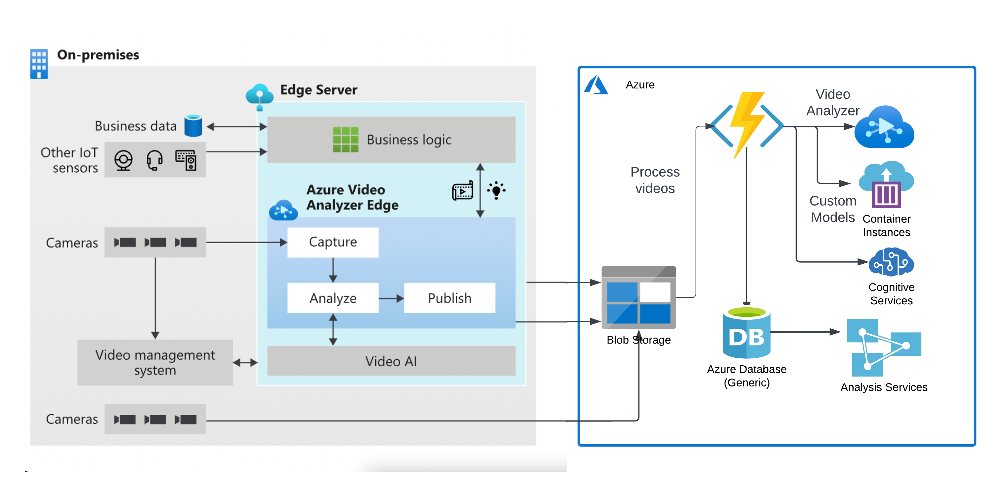

# [SBI - Video Analytics](https://www.techgig.com/hackathon/video-analytics) - Idea submission

## Objective
```
Surveillance is being constantly carried out via Video Cameras at Branches, ATMs & Offices of the Bank. As a proactive measure and to protect against unscrupulous elements, the video feed is constantly monitored by personnel at Command Centres / Control rooms.

The following are the expectations from the prototype:
Constantly scanning multiple video footage for:
 - suspicious Activities
 - Hazardous Objects being brought into the premises.
 - Break / Interruption in footage
 - Tampering with the cameras / sensitive or high priority area within premises.
 - Count of People
 - Identification of known miscreants
 - Any activity that needs attention
 - Fire / Theft related incident taking place
 - Time taken for activity in premises
 - Identification of known facilitators
 - Communication with Control / Command Centres / Vendors
 - Feedback mechanism for false positives / incorrect classification for enhancement in model
```

## Solution Proposed (POC)
```
The idea is to use the following:

- Cognitive Services to detect textual information from the frames (Computer Vision)
- Cognitive Services to detect objects (Computer Vision OCR)
- Custom Models trained to detect other required entities (Custom Vision as required)
- Custom models for face matching
- Azure Functions for parallel processing of videos and scal

The FLow of Processing:

1. The whole flow starts with reading videos from edge devices and publishing them on the azure blob for processing.
2. Once a new video is uploaded (synchronized) in Azure Blob Storage, it shall be immediately processed.
3. Azure Blob storage has a trigger that executes a simple Azure function that sends the message to Azure Queue
4. Azure Queue has a trigger that executes an advanced Azure function that 
    1) retrieves video from a blob storage account
    2) takes every second a frame of the video using OpenCV and 
    3) detect required entities by calling other services attached 
    4) writes results to a CSV file and uploads it to Cloud storage
5) Optionally, one can connect this to Analytics services such as POWER BI to see results 

Accordingly, the YOLOv3 model will be used which can detect many types of objects from video frames with low latency and high accuracy.
```

## Architecture (POC)
