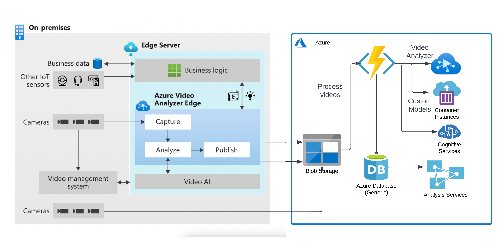
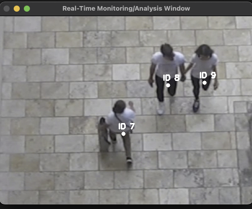
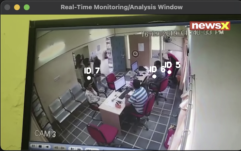
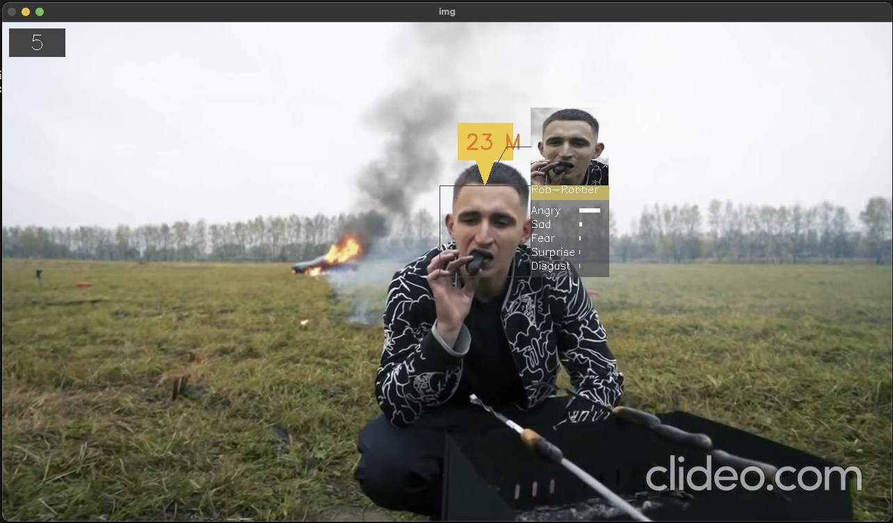
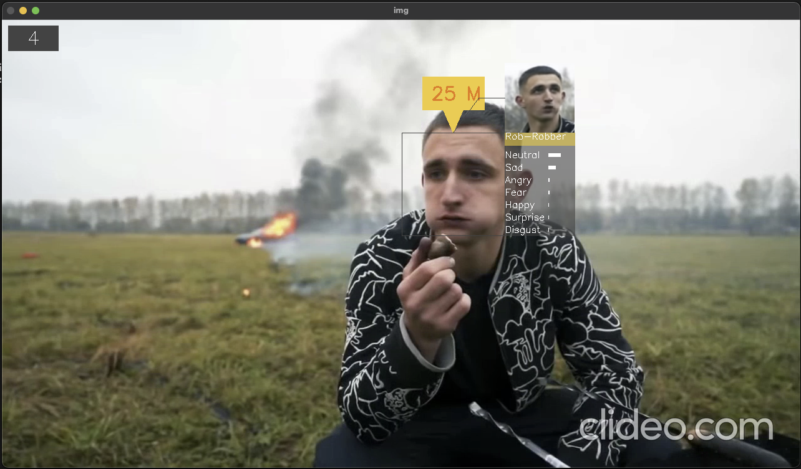
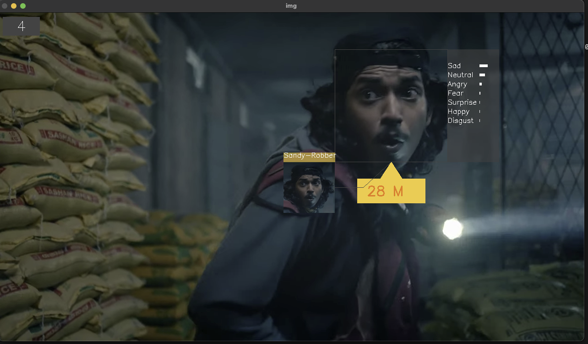
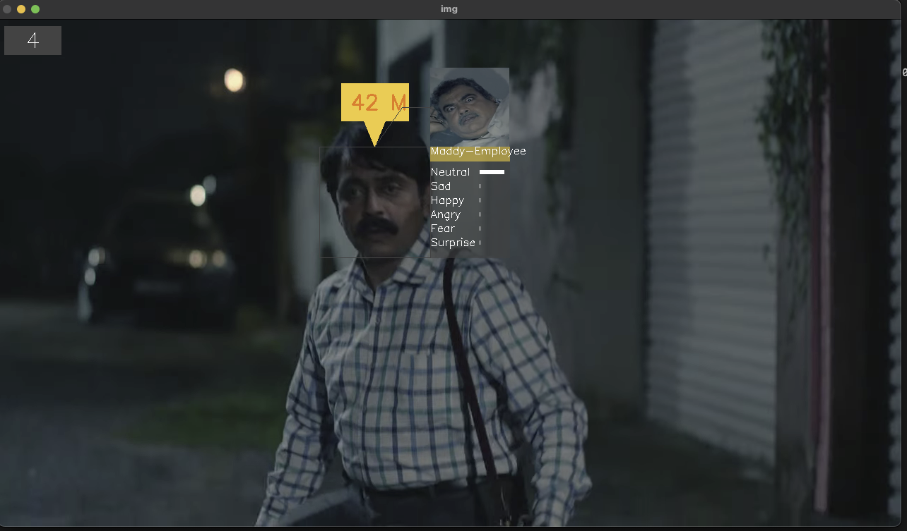
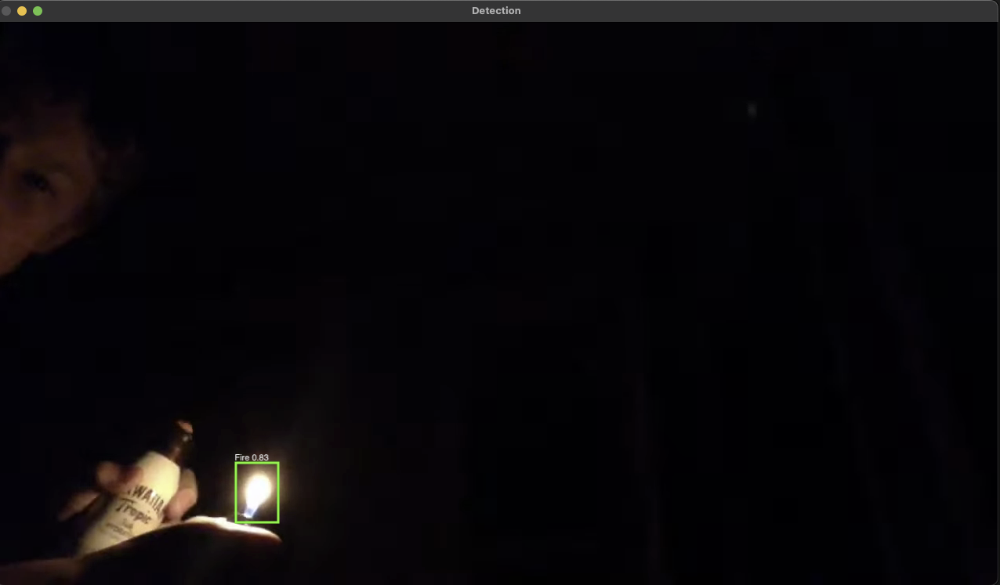
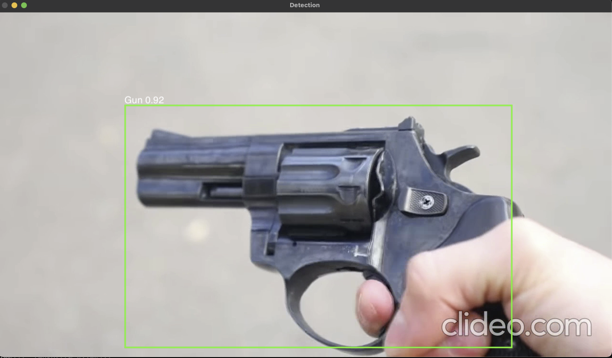

# [SBI - Video Analytics](https://www.techgig.com/hackathon/video-analytics) 

## Objective
```
Surveillance is being constantly carried out via Video Cameras at Branches, ATMs & Offices of the Bank. As a proactive measure and to protect against unscrupulous elements, the video feed is constantly monitored by personnel at Command Centres / Control rooms.
```

## Solution Expected:
```
The following are the expectations from the prototype:
    Constantly scanning multiple video footage for:
        - suspicious Activities
        - Hazardous Objects being brought into the premises.
        - Break / Interruption in footage
        - Tampering with the cameras / sensitive or high priority area within premises.
        - Count of People
        - Identification of known miscreants
        - Any activity that needs attention
        - Fire / Theft related incident taking place
        - Time taken for activity in premises
        - Identification of known facilitators
        - Communication with Control / Command Centres / Vendors
        - Feedback mechanism for false positives / incorrect classification for enhancement in model
```
## Solution Architecture - POC


## Solution Architecture - PROD



## Solution Samples

### Count of People



### Time taken for activity in premises



### Identification of known miscreants





### Suspicious Activities


### Identification of known facilitators


### Fire / Theft related incident taking place


### Hazardous Objects being brought into the premises.



